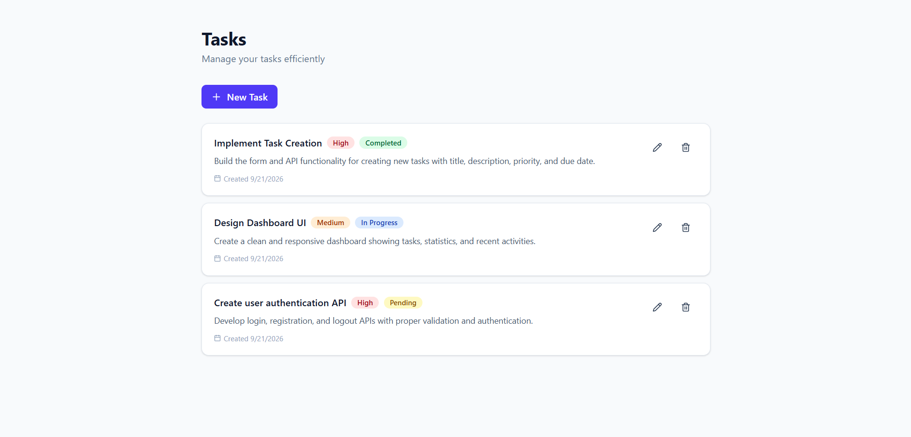
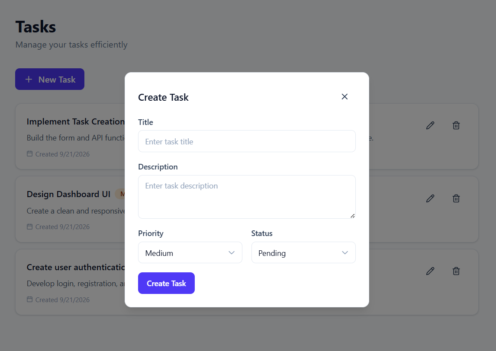
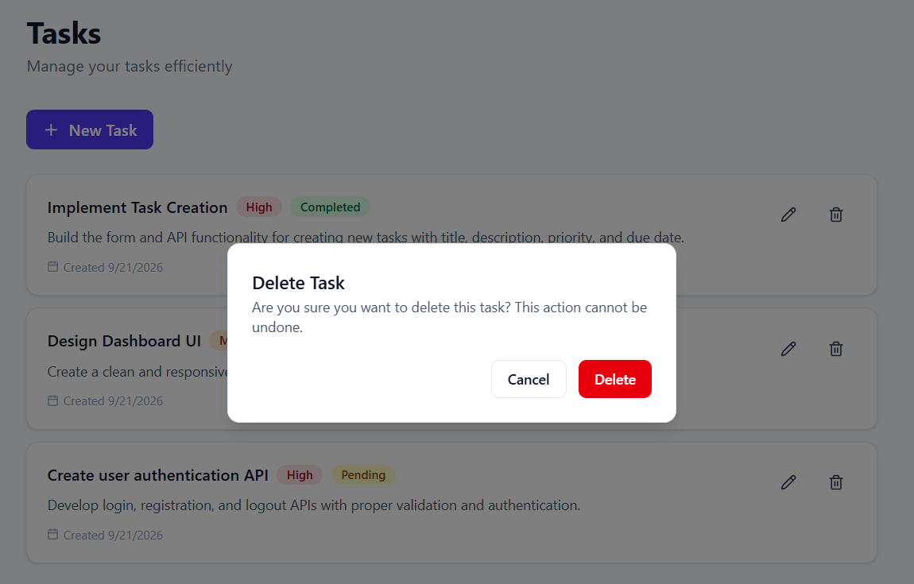
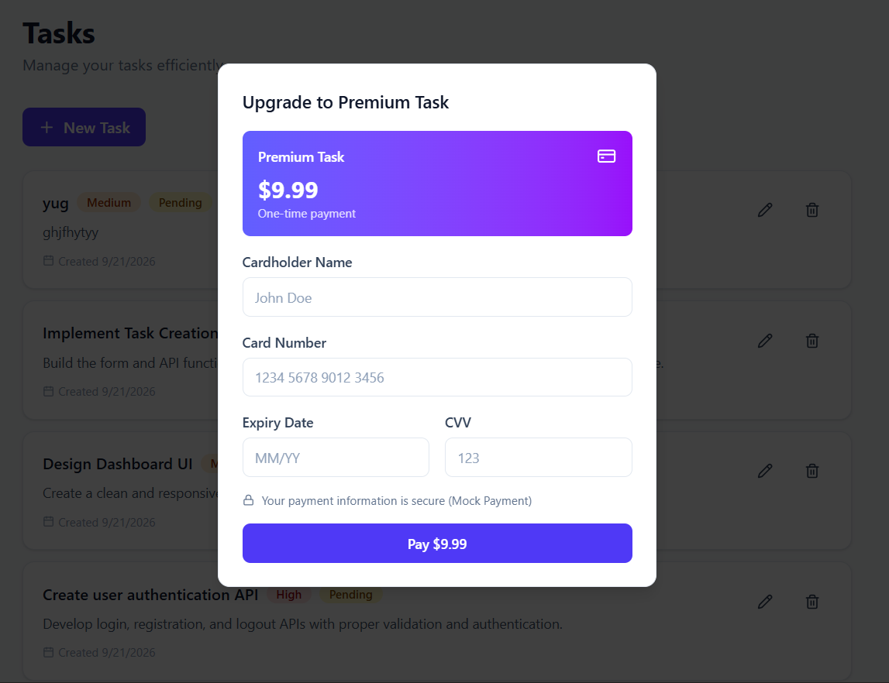

# Task Management Portal

A full-stack web-based project and task management portal built with React, Node.js/Express, and MySQL. Users can create, view, update, and manage tasks through a responsive interface.

## Features

- **Full CRUD Operations**: Create, read, update, and delete tasks
- **Form Validation**: Real-time validation using React Hook Form + Zod
- **Loading States**: Visual feedback during data fetching and form submission
- **Error/Success Messages**: Toast notifications using Sonner
- **Delete Confirmation**: Custom AlertDialog for safe deletion
- **Empty States**: Friendly messages when no tasks exist
- **Mobile-Responsive Layout**: Optimized for all screen sizes
- **Modern UI**: Built with Tailwind CSS and shadcn/ui components
- **RESTful API**: Express.js backend with MySQL database
- **Premium Tasks (Bonus)**: Mock payment integration for premium task creation ($9.99)

## Task Fields

Each task contains:
- Title (3-100 characters)
- Description (5-500 characters)
- Priority (Low/Medium/High)
- Status (Pending/In Progress/Completed)
- Premium (Optional - requires mock $9.99 payment)
- Created Date (auto-generated)

## Tech Stack

### Frontend
- React 19.3.0
- Vite 8.3.0
- Tailwind CSS 4.3.3
- React Hook Form
- Zod (validation)
- Lucide React (icons)
- Sonner (notifications)
- Axios (HTTP client)

### Backend
- Node.js 18+
- Express 5.2.1
- MySQL 8.0
- mysql2 (database driver)
- CORS
- dotenv

## Project Structure

```
acme-task-management/
├── backend/
│   ├── routes/
│   │   └── tasks.js          # API routes
│   ├── db.js                 # Database connection
│   ├── server.js             # Express server
│   ├── .env.example          # Environment variables template
│   ├── Dockerfile            # Backend container
│   └── package.json
├── frontend/
│   ├── src/
│   │   ├── components/
│   │   │   ├── ui/           # shadcn/ui components
│   │   │   ├── TaskForm.jsx  # Form component
│   │   │   └── TaskList.jsx  # Task list component
│   │   ├── lib/
│   │   │   └── validations.js # Zod schemas
│   │   ├── services/
│   │   │   └── taskApi.js    # API service
│   │   ├── App.jsx           # Main app component
│   │   └── main.jsx          # Entry point
│   ├── Dockerfile            # Frontend container
│   ├── nginx.conf            # Nginx configuration
│   └── package.json
├── database/
│   └── schema.sql            # Database schema
├── docker-compose.yml        # Docker orchestration
└── README.md
```

## Prerequisites

- Node.js 18 or higher
- MySQL 8.0 or higher
- npm or yarn

## Setup Instructions

### Option 1: Docker (Recommended)

1. **Clone the repository**
   ```bash
   git clone <repository-url>
   cd acme-task-management
   ```

2. **Start with Docker Compose**
   ```bash
   docker-compose up -d
   ```

3. **Access the application**
   - Frontend: http://localhost
   - Backend API: http://localhost:3000
   - Database: localhost:3307 (mapped from container port 3306)

4. **Stop the application**
   ```bash
   docker-compose down
   ```

### Option 2: Manual Setup

#### Database Setup

1. **Create MySQL database**
   ```bash
   mysql -u root -p < database/schema.sql
   ```

   Or manually execute the SQL:
   ```sql
   CREATE DATABASE task_management;
   USE task_management;
   
   CREATE TABLE tasks (
     id INT AUTO_INCREMENT PRIMARY KEY,
     title VARCHAR(100) NOT NULL,
     description TEXT NOT NULL,
     priority ENUM('Low', 'Medium', 'High') NOT NULL DEFAULT 'Medium',
     status ENUM('Pending', 'In Progress', 'Completed') NOT NULL DEFAULT 'Pending',
     created_at TIMESTAMP DEFAULT CURRENT_TIMESTAMP,
     updated_at TIMESTAMP DEFAULT CURRENT_TIMESTAMP ON UPDATE CURRENT_TIMESTAMP
   );
   ```

#### Backend Setup

1. **Navigate to backend directory**
   ```bash
   cd backend
   ```

2.Install dependencies**
   ```bash
   npm install
   ```

3. **Configure environment variables**
   ```bash
   cp .env.example .env
   ```
   
   Edit `.env` with your database credentials:
   ```
   PORT=3000
   DB_HOST=localhost
   DB_USER=root
   DB_PASSWORD=your_mysql_password
   DB_NAME=task_management
   DB_PORT=3306
   ```

4. **Start the backend server**
   ```bash
   npm start
   ```
   
   Server will run on http://localhost:3000

#### Frontend Setup

1. **Navigate to frontend directory**
   ```bash
   cd frontend
   ```

2. **Install dependencies**
   ```bash
   npm install
   ```

3. **Start the development server**
   ```bash
   npm run dev
   ```
   
   Application will run on http://localhost:5173

## API Endpoints

| Method | Endpoint | Description |
|--------|----------|-------------|
| GET | `/api/tasks` | Get all tasks |
| GET | `/api/tasks/:id` | Get a specific task |
| POST | `/api/tasks` | Create a new task |
| PUT | `/api/tasks/:id` | Update a task |
| DELETE | `/api/tasks/:id` | Delete a task |

### API Request/Response Examples

**Create Task**
```bash
POST /api/tasks
Content-Type: application/json

{
  "title": "Complete project",
  "description": "Finish the task management portal",
  "priority": "High",
  "status": "In Progress"
}
```

 Response:
```json
{
  "id": 1,
  "title": "Complete project",
  "description": "Finish the task management portal",
  "priority": "High",
  "status": "In Progress",
  "created_at": "2024-01-15T10:30:00.000Z",
  "updated_at": "2024-01-15T10:30:00.000Z"
}
```

## Environment Configuration

### Backend (.env)
```
PORT=3000
DB_HOST=localhost
DB_USER=root
DB_PASSWORD=your_password
DB_NAME=task_management
DB_PORT=3306
```

## Running Scripts

### Backend
```bash
cd backend
npm start              # Start server
```

### Frontend
```bash
cd frontend
npm run dev            # Start development server
npm run build          # Build for production
npm run preview        # Preview production build
```

## Docker Commands

```bash
# Build and start all services
docker-compose up -d

# View logs
docker-compose logs -f

# Stop all services
docker-compose down

# Stop and remove volumes
docker-compose down -v

# Rebuild specific service
docker-compose up -d --build backend
```

## Error Handling

The application includes comprehensive error handling:

- **Frontend**: Form validation with Zod, toast notifications for success/error states
- **Backend**: Input validation, proper HTTP status codes, error logging
- **Database**: Connection pooling, query error handling

## Validation Rules

- **Title**: 3-100 characters, required
- **Description**: 5-500 characters, required
- **Priority**: Must be "Low", "Medium", or "High"
- **Status**: Must be "Pending", "In Progress", or "Completed"

## Screenshots

### Task List View


### Create/Edit Task Dialog


### Delete Confirmation Dialog


### Payment Dialog (Bonus Feature)


## Bonus Feature: Premium Tasks with Mock Payment Integration

This project includes a mock payment gateway integration for premium tasks as a bonus feature, demonstrating sandbox payment flow without real transactions.

### Overview

Users can upgrade tasks to "Premium" status by completing a mock payment process. This feature simulates a real payment gateway experience while keeping all data local and secure.

### How It Works

1. **Create Premium Task**: When creating a new task, check the "Premium Task ($9.99)" checkbox in the form
2. **Payment Dialog**: A payment dialog appears requesting card details (cardholder name, card number, expiry date, CVV)
3. **Mock Processing**: The form simulates a 2-second payment processing delay to mimic real payment gateway behavior
4. **Task Creation**: After successful "payment", the task is created with `is_premium: true` in the database
5. **Premium Badge**: Premium tasks display a star icon (⭐) next to the title in the task list for easy identification

### Payment Flow

```
User fills task form
         ↓
User checks "Premium Task" checkbox
         ↓
User clicks "Create Task"
         ↓
Payment Dialog opens
         ↓
User enters mock card details
         ↓
User clicks "Pay $9.99"
         ↓
2-second processing delay (simulated)
         ↓
Task created with premium status
         ↓
Success toast notification
         ↓
Task appears in list with star badge
```

### Technical Implementation

- **Frontend**: PaymentDialog component with mock form validation
- **Backend**: Updated API routes to handle `is_premium` field
- **Database**: Added `is_premium` BOOLEAN column to tasks table
- **Flow**: Form submission → Payment dialog → Mock processing → Task creation

**Note**: This is a sandbox/mock payment integration. No real payments are processed. All card data is local and not transmitted to any payment gateway.

## License

ISC

## Author

Nafisa Kamal
